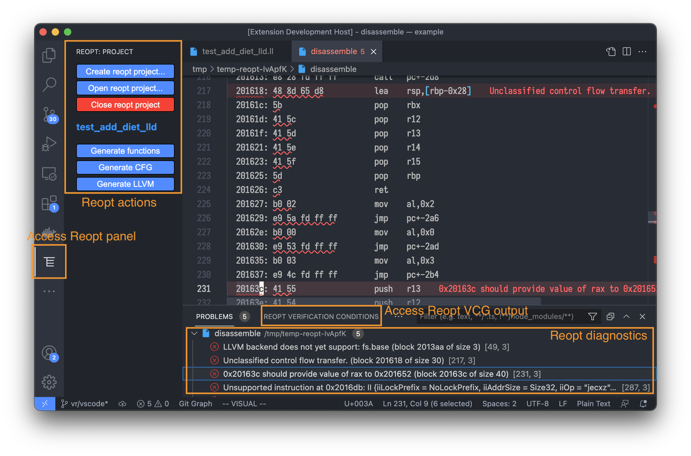
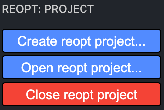
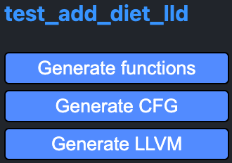
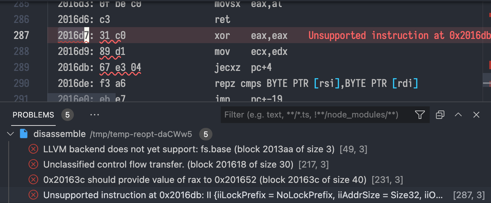
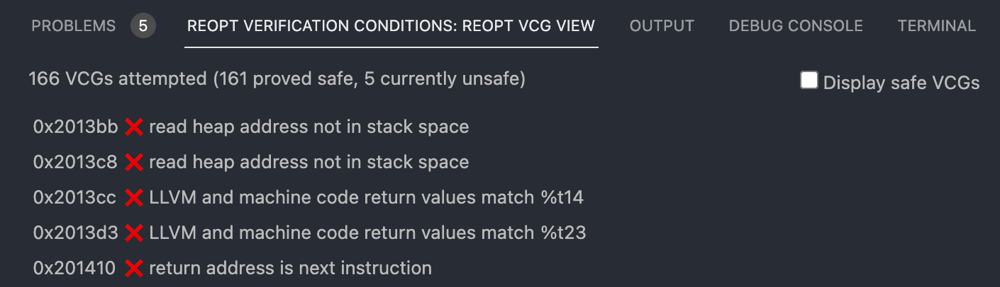

# Reopt VSCode plugin

Note: This tool is still experimental.  The features described here are subject
to change.

Reopt's VSCode plugin helps users better understand the contents of compiled
executables and use Reopt's capabilities to extract LLVM bytecode from files as
well as recompile files into new executables.

## Using Reopt in VSCode

The Reopt VSCode plugin introduces a new file type, Reopt project files.  These
store information for running Reopt on a specific binaries including paths to
the binaries.

### Setting up a Reopt project

To create a Reopt project file, you can open the Reopt plugin activity pane by
clicking on this icon:

The activity pane should contain a `Create reopt project...` button.

You can click it, and point the file picker at an executable to create a basic
Reopt project file automatically.  Currently, this file has the following
fields:

| Field name              | Type       | Description                                                          |
| ----------------------- | ---------- | -------------------------------------------------------------------- |
| `annotations`           | `string`   | Output file for `reopt` to drop analysis annotations for `reopt-vcg` |
| `binaryFile`            | `string`   | The binary file that this project works on                           |
| `excludes`              | `string[]` | Excludes passed to `reopt`                                           |
| `headers`               | `string[]` | Headers passed to `reopt`                                            |
| `includes`              | `string[]` | Includes passed to `reopt`                                           |
| `name`                  | `string`   | Name of the project, only used for display                           |
| `outputNameCFG`         | `string`   | Path for the CFG output file for `reopt`                             |
| `outputNameDisassemble` | `string`   | Path for the disassembly output file for `reopt`                     |
| `outputNameFunctions`   | `string`   | Path for the functions output file for `reopt`                       |
| `outputNameLLVM`        | `string`   | Path for the LLVM output firl for `reopt`                            |

### Running `reopt`

Once the project is open, three buttons will be available: `Generate functions`,
`Generate CFG`, and `Generate LLVM`.  They will each run the corresponding
action in `reopt`, and open the output in a new editor.

All three actions will also open a transient tab with the disassembly of the
executable: this is currently used to highlight diagnostics in case of issues
during the processing of the executable.

### Running `reopt-vcg`

When the extension is loaded, a "Reopt Verification Conditions" panel is added
to the VSCode panels (such as "Problems", "Output", "Debug console", etc.).  You
can toggle the panels visibility by accessing your command palette and running
the `View: Toggle Panel` command.

Currently, the extension will automatically run `reopt-vcg` after having
generated LLVM.  If you open the panel, you should see diagnostics about how
many verification conditions have been discharged so far, and a list of all
verification conditions that have failed.

## Building the Reopt VSCode plugin

This project is set up with the [Node Package
Manager](https://docs.npmjs.com/downloading-and-installing-node-js-and-npm). The
install process is standard, using `npm install` to download all the build
dependencies locally, and `npm run compile` to compile the project.

We provide VSCode settings so that the project can be run and debugged within
VSCode.  See `.vscode/` for more information.

To build a bundled VSIX extension file, after `npm install`, you can run `npx
vsce package`.  The output file can be installed from VSCode's extension pane,
or by running the VSCode command "Extensions: Install from VSIX...".

To update the dependencies to the latest versions, after `npm install`, you can
run `npx ncu -u`.  Then, you need to run `npm install` again to locally install
the new, updated dependencies.
